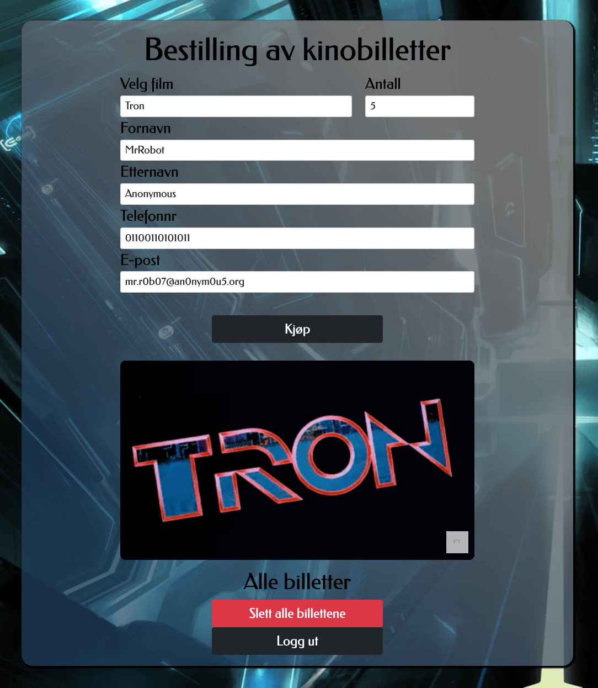

## kinobilletter

 
[To webapp](https://kinobilletter.onrender.com/)

## Table of Contents

- [About the Project](#about-the-project)
- [Features](#features)
- [Technology Used](#technology-used)
- [Dependencies](#dependencies)
- [Contributors](#contributors)
- [License](#license)

## About the Project

**kinobilletter** is a demo web application of a cinema ticket system created in intelliJ. It is based on an obligatory assignment from the [Web Programming course](https://student.oslomet.no/studier/-/studieinfo/emne/DATA1700/2022/H%C3%98ST) at OsloMet in 2022. This project expands significantly on the original assignment, providing a more polished and functional user experience.

## Features

- **Dynamic Backgrounds:** Changes based on the selected movie.
- **Trailer Integration:** Renders a movie trailer below the "Buy" button for each selected movie.
- **Minimalistic Design:** Features a large card with a glasslike, see-through style, blue tint, and gradient color changes.
- **Responsive Layout:** Adapts to different screen sizes for an optimized user experience.
- **Admin Authentication:** Allows new admin registration and secure login with encrypted passwords.
- **In-Memory Database:** Uses an H2 database for demonstration purposes.
- **Admin Functions:** Provides an admin account to delete all purchased tickets.
- **Docker Support:** Includes a Dockerfile for easy deployment on platforms like Render.com.

## Technology Used

- **Backend:** Maven Spring Boot framework with Java for database communication.
- **Frontend:** HTML5, styled with Bootstrap and custom CSS rules, and JavaScript with jQuery.
- **Database:** In-memory H2 database.
- **Deployment:** Render.com using a Dockerfile for managing the environment.

## Dependencies

- **Spring Boot:** For building the backend services.
- **H2 Database:** For in-memory database functionality.
- **Bootstrap:** For styling and responsive design.
- **jQuery:** For front-end JavaScript operations.
- **Docker:** For containerization and deployment.

## Contributors

- This project was developed by [Pholdahl](https://github.com/pholdahl).

## License

This project is licensed under the MIT License.